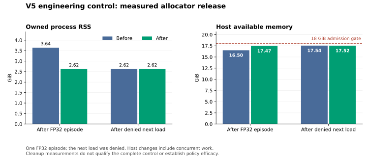
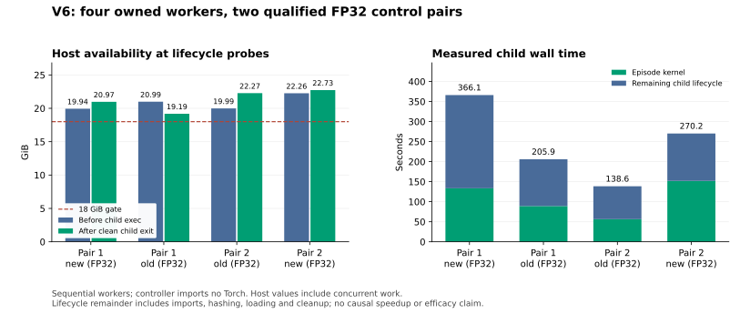

# Persistence replay and the next performance decision

This is an engineering measurement, not a policy-update result. The frozen v2
collector and its NPZ writer remain unchanged. The existing failed v1 cohort
remains failed; its retained observations are used only as read-only benchmark
inputs.

## Measurement

`profile_persistence.py` samples eight evenly spaced snapshots, including the
terminal snapshot, from each of the two complete v1 FP32 episodes. It makes
three repetitions per snapshot and shuffles the order of three writers with a
fixed seed. It calls the actual SHA-pinned native writer for the baseline.
Candidate writers retain file fsync, atomic replace and directory fsync.
Input reading and array verification are outside the measured write time.
All 144 writes were checked for field, shape, dtype and array-value equality.

The CPU replay ran while a separate v2 native control was loading. Warm caches,
sampled images and shared disk contention limit extrapolation. Full measurements
and raw images are retained locally; the public JSON is an aggregate report with
sample identities and hashes, not a public raw-data replication package.

| Writer | Median durable write | Mean NPZ size | Sample-based 80-pair storage |
| --- | ---: | ---: | ---: |
| Native compressed NPZ | 50.87 ms | 216,590 bytes | 18.05 GB |
| Deflate level 1 | 24.41 ms | 253,920 bytes | 21.17 GB |
| Stored NPZ | 11.00 ms | 781,218 bytes | 65.12 GB |

Storage assumes 160 episodes, 520 inputs and one terminal snapshot per episode.
It covers NPZ only, excludes other evidence and reserve space, and is a sample
mean rather than a guaranteed admission bound. Stored NPZ alone exceeds the
approximately 63.14 GB free disk measured at the new control's admission.

The two historical episodes together contain 554 intervals ending at a cached
action step and 18 ending at an action-refresh step. Their medians are 0.620 s
and 2.207 s. These intervals combine the preceding simulator advance, evidence
recording, preprocessing and action selection; they are not isolated model
latency or isolated simulator latency.

The native writer's approximately 51 ms is small compared with the cached-action
interval. Halving that writer's median saves approximately 26 ms per snapshot.
This comparison uses separate measurements and cannot establish an end-to-end
speedup. Compression alone is unlikely to make the fixed 80-pair experiment fit
the remaining shared physical budget.

## Next decision

The completed v6 independent-reload control below qualifies the frozen collector.
Use its full-horizon forecast and the frozen 50% margin for primary admission.
Any further collector change still requires a distinct published control.
Keep all 80 pairs, the single environment lane, both precision pipelines, the
520-step horizon, reset/scoring checks and complete evidence.

Before adopting a faster collector, separately time:

1. Simulator `step`, including rendering and environment observation work.
2. Observation conversion, processor execution and action postprocessing.
3. Policy action selection, distinguishing cached steps from prediction steps;
   account for CUDA synchronization when interpreting wall times.
4. Snapshot encoding, file and directory sync, action/transition persistence.
5. Checkpoint hashing, model construction, weight loading and model release.

Use a new published protocol/context and a distinct engineering cohort for
instrumented or optimized native collection. Instrumentation should preserve
RNG use, model inputs, actions, physics and scoring. Qualify any adopted writer
with the same native control and independently verify complete retained arrays.
Do not reuse a failed cohort or reinterpret the replay as a clean native control.

The v3 introduced `--profile-episodes` for a new control cohort; v4 also
binds the cached text tokenizer's immutable snapshot and file inventory.
Its `phase-profile.json` records every call, inclusive wall/CPU time, count and
error flag. A completed episode requires the expected snapshot, prediction-call,
processor, reset, step and close counts with no failed timed call. CPU checks
verify return and argument identity, exception identity, exact call order and
restoration of both inherited and own attributes on success and error.
The separate v4 attempt collected two instrumented episodes, as recorded below.

## New v2 control and host observation

The separate v2 attempt used its preserved source `d58c0bc`, not the new timers.
One complete independent FP32 pair passed the comparator: both episodes succeeded
at step 287, with all saved arrays, actions and transitions equal, including
intermediate camera frames. The second pair's first load was denied when host
available memory fell to 15,283,400,704 bytes, below the fixed 18 GiB threshold.
The worker exited 1. The full two-pair clean-lifecycle control remains unqualified,
and the primary gate rejects it. Actual charged time is 920.179 seconds; the
canonical 12-hour ledger was finalized, not reset. Its remaining balance at that
point was 10.412 hours.
No BF16 or primary pair was collected.

The host has four logical CPUs. Read-only samples during collection found
23–24 runnable tasks, zero CPU idle and approximately 93% CPU pressure. Other
rendering/encoding tasks were active; their jobs and priorities were unchanged.
The two identical-output episodes took 184.0 and 291.7 seconds inside the episode
kernel. This demonstrates variable host wall time, not a measured policy speedup
or attribution of all overhead to one phase. Collect phase timings under a stable
resource window before adopting an optimization or forecasting the fixed study.

See `engineering-control-v2-001.json` and `cpu-contention-001.json`. Full raw
episodes remain local. The BART tokenizer snapshot was not separately bound in
v2; `tokenizer-assets-audit-001.json` compares the current cached and explicit
snapshot tokenizers on CPU, not historical tokenizers. Vocabulary, parsed backend
and all encoded fields for five strings (including the selected task prompt)
match. This audit constructs no policy and initializes no CUDA context. Future
v4 and later load the explicit snapshot and reject changed files or optional-file inventory.

The latest official LeRobot release checked on October 1 is still v0.6.1:
https://github.com/huggingface/lerobot/releases/tag/v0.6.1.
Its release notes describe direct-device safetensors loading in shared policy
code, but the pinned X-VLA override constructs its instance and loads a CPU state
dictionary before moving it. General release notes do not establish that this
specific loader is already optimized. Any alternate loader needs a separate
prospective design, tensor verification and native control.

## Instrumented v4 result and prospective v5 cleanup

The v4 attempt (`6ef051b`) completed one exact FP32/FP32 pair: both episodes
succeeded at step 287, with all retained observations, actions and transitions
equal and no off-cadence camera differences. Both phase profiles passed their
call-count and error guards. Episode kernel times were 282.162 and 292.689 s.
The next load was denied at 18,586,587,136 available host bytes, below 18 GiB;
worker exit 1 means the full two-pair control remains unqualified.
Charged time was 908.193 s. The finalized ledger then retained 36,575.908 s.
See `engineering-control-v4-001.json`; no BF16 or primary data were collected.

For the second episode, snapshot persistence took 69.702 s inclusive wall time
and 9.060 s process CPU time; simulator steps took 56.575 / 7.553 s, action
selection 50.596 / 8.302 s, and observation conversion 34.607 / 8.249 s.
These are inclusive, partly overlapping timers without added CUDA
synchronization. Their CPU/wall gaps do not isolate scheduler, disk or GPU waits.
They do not establish an end-to-end speedup or justify summing phases as GPU time.

V5 prospectively calls glibc `malloc_trim(0)` in the collector's own process
after model references, garbage collection and the inherited CUDA cleanup.
It records own RSS and global host availability before and after the call.
The API releases unused allocator pages; it does not free live tensors or alter
other processes. Retained allocator pages are a hypothesis, not an established
cause of the resource failures. A fresh-process API check and CPU adapter tests
do not validate cleanup after an actual model reload. A distinct native cohort
is required. The original 18 GiB host and 28 GiB free GPU gates remain fixed.
API reference: https://man7.org/linux/man-pages/man3/malloc_trim.3.html.

V5 also separates the largest observed pair overhead from episode time, scales
the largest observed episode seconds per step to 520 steps on both sides, then
applies 80 pairs and the existing 50% margin. Successful early termination at
287 steps must not understate a possible full-horizon study. This sample-based
forecast is not a worst-case guarantee: precision behavior and shared host load
can differ. Infeasible admission stops collection without shrinking the sample.

## Actual v5 result

The distinct v5 attempt used published source `7c33804`, after its 31 CPU
checks and remote archive/analysis reproduction passed. One FP32 episode
succeeded at step 287, with 276.024 s inside the episode kernel. Its complete
raw file inventory and hashes, attempt/episode binding and phase counts were
independently reread. This is a single episode, not a matched pair.

After model close and inherited gc/CUDA cleanup, the first `malloc_trim(0)`
call took 0.365 s. Process RSS fell from 3,906,662,400 to 2,813,960,192 bytes:
1,092,702,208 bytes, or approximately 1.018 GiB. Host availability at the
two snapshots increased from 17,716,830,208 to 18,753,150,976 bytes; concurrent
activity can contribute to that global change. At the next load's admission
probe, host availability was 18,750,988,288 bytes, still below 18 GiB. GPU
headroom passed. The worker exited 1, with zero complete pairs and no timeout.

The cleanup after the denied load returned 1 but did not reduce measured RSS.
The libc return value alone must not be reported as a measured memory saving.
The observed first cleanup released unused pages, but did not solve resource
admission on this shared host. No matched-output equivalence or stable repeated
reload result is established for v5.



Actual physical charge was 645.967 s; all canonical ledger entries were finalized,
with 35,929.941 s (9.981 h) remaining and no open reservation. The original
control gate independently rejected this cohort. No primary forecast can be
qualified from it, and no new BF16 or primary pair was collected.
See `engineering-control-v5-001.json`. Complete raw data remain local.

Do not retry this cohort or continue successive native attempts under the same
resource pressure. Retain v5 as a measured operational improvement with an
unqualified control. A future attempt needs a stable resource window or a
separately published and controlled lifecycle redesign, such as an owned worker
per model side. That redesign had not been implemented at the v5 decision;
its subsequent prospective v6 implementation and separate control are below. Keep the
fixed sample size, evidence and admission gates; leave unrelated jobs unchanged.
The published r2 paper and its historical conclusions remain unchanged.

Rebuild the engineering figure from the public measurements, without loading a
policy or reading raw images:

```sh
python tools/plot_cpu_release.py \
  experiments/confirmation-20261001/engineering-control-v5-001.json \
  /path/to/figure-output/cpu-release-v5-001
```

## Prospective v6 model lifecycle

The v5 worker retained 2.620 GiB RSS after the measured trim. V6 instead uses a
new supervised Python exec process for each model side. Its controller neither
constructs a policy nor imports Torch. A side must save matching native evidence
and exit cleanly before its outcome is adopted or another worker can start.
The controller probes resources before spawning; the unchanged native backend
also probes after imports and immediately before model construction.

The request, original native episode, worker summary and process receipt are
included in each adopted episode's hashed inventory. Later control qualification
rereads their identities, summaries and clean integer exits. One retained
success with a nonzero exit or timeout is still a failed attempt. Linux
parent-death protection terminates a side if its controller is hard-killed.
The outer canonical reservation covers all children and their cleanup, rather
than starting a new ledger or independent budget for each side.

CPU checks use clearly labelled synthetic records and actual subprocesses.
They exercise distinct side PIDs, ordering, cache revalidation, nonzero exits,
collection/teardown deadlines, pre-spawn resource denial and hard parent death.
They load no policy or simulator and provide no native output-equivalence,
memory-stability or speedup result. A new published cohort must qualify all
four FP32 episodes before any primary forecast or launch.

Fresh startup and checkpoint hashing can increase overhead. V6 preserves
`nice 10`, source/assets/package guards, rendering, evidence format, the 520-step
horizon and the fixed 80 pairs. Changing process state changes the evaluator:
previous partial controls cannot qualify it. No new control has been run for
this revision yet.

## Actual v6 isolated-side control

The distinct v6 control used source `12085c60586fe8ca93a754500480be15a6466fac`,
published before launch after 39 CPU checks and remote archive/analysis
reproduction passed. Two independently seeded FP32/FP32 pairs completed.
The first pair succeeded at step 287 on both sides; the second at step 292.
Actions, physics, transitions and retained observations passed the frozen
comparator. Both off-cadence camera diagnostic lists are empty.

All four exec-created model workers exited normally with integer code 0.
Their identities, request/summary hashes and original native episode payloads
were independently reread, alongside complete raw inventories and phase guards.
The outer controller also exited 0 and recorded `parent_torch_imported=false`.
The actual `verified_control` function accepted the completed cohort. These
measurements qualify this frozen control; they do not establish a failure rate
for all future reloads or efficacy for FP32/BF16 updates.



The plot reports global host availability immediately before each child exec
and after its clean exit. Changes include concurrent external activity and
cannot be attributed wholly to worker isolation. The wall-time bars separate
the recorded episode kernel from the remaining measured child lifecycle,
including imports, checkpoint verification, loading and cleanup. They do not
claim causal acceleration or isolate GPU time.

Pair collection times were 575.397 and 412.416 s. Actual canonical physical
charge was 1,016.409 s, including the outer lifecycle. All reservations are
finalized, with 34,913.532 s (9.698 h) remaining; the 12-hour ledger was not reset.

The frozen forecast uses maximum observed pair fixed overhead 352.713 s and
maximum episode rate 0.520460 s/step. Scaling both sides to 520 steps, retaining
80 pairs and applying the existing 50% margin yields **107,281 s (29.800 h)**,
before the additional 135 s lifecycle reservation. This exceeds both remaining
physical budget and the current single-launch bound. Primary collection was
not admitted. No new primary pair or BF16 episode was produced.

Source, contexts and failed older controls are preserved. Timing varied on the
shared host, so this sample-based forecast is not a worst-case guarantee.
Further collector optimization requires its own prospective protocol and
control; a lower sample size or new ledger cannot be used to bypass admission.
The published r2 manuscript and historical outcomes remain unchanged.
See `engineering-control-v6-001.json`. Complete raw evidence remains local.

Rebuild the figure from the public aggregate measurements:

```sh
python tools/plot_isolated_control.py \
  experiments/confirmation-20261001/engineering-control-v6-001.json \
  /path/to/figure-output/isolated-control-v6-001
```

## Reproduce the CPU replay

```sh
python experiments/confirmation-20261001/profile_persistence.py \
  --runtime-root /path/to/audited-runtime \
  --episode /path/to/complete-old-episode \
  --episode /path/to/complete-new-episode \
  --output /path/to/new-benchmark-directory \
  --concurrent-native-collection
```

Omit `--concurrent-native-collection` when no native collection overlaps the
benchmark. This command does not construct a policy or run a simulator. It
requires the pinned native writer and numerical NPZ observations; the output
directory must be new and outside the preserved episode directories.
